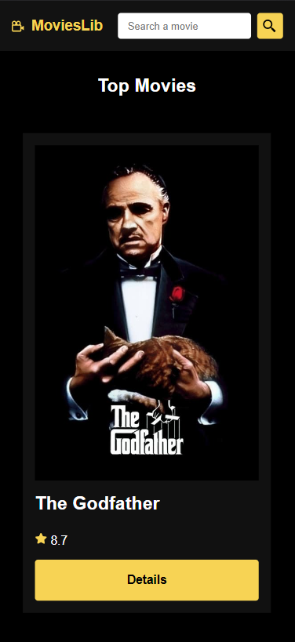
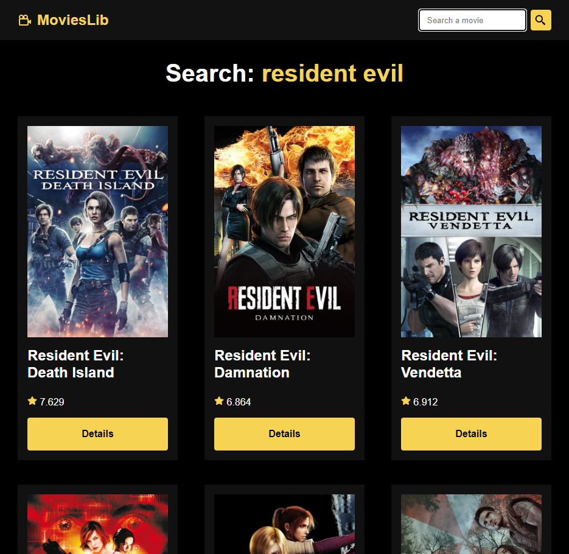

# movies-lib-react

Movies Lib React

React project, consuming a <a href="https://developer.themoviedb.org/docs">TMDB API</a>, created with Vite.

I'm worked on this project to learn about React and APIs. 📚

